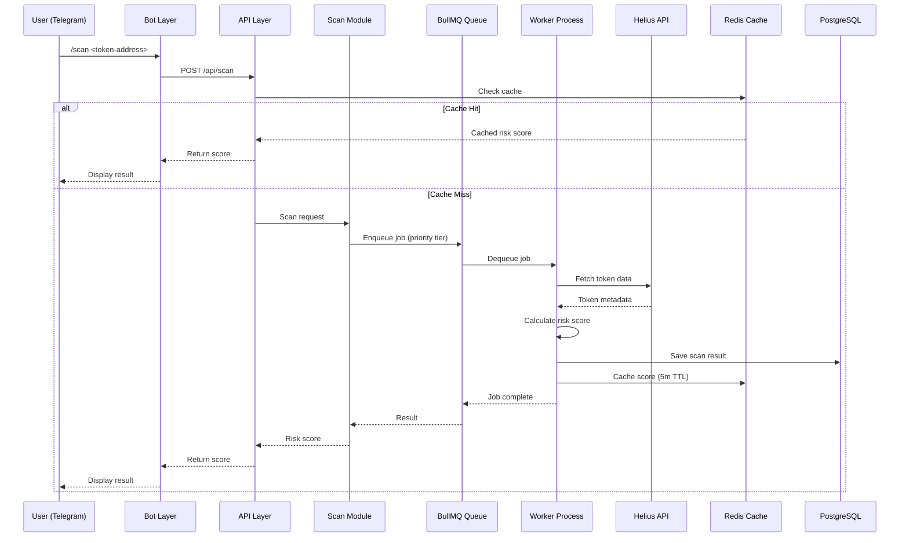

# CryptoRugMunch System Architecture Diagram - Design Specification

**Format**: Single-page vertical diagram (11" × 17" portrait, or 1100px × 1700px for digital)
**Title**: "CryptoRugMunch: Technical Architecture Overview"
**Target Audience**: Engineers, CTOs, technical investors, DevOps teams
**Purpose**: Visual representation of the modular monolith architecture, component interactions, and data flow

---

## Visual Overview

**Layout**: Top-to-bottom layered architecture (6 layers) with data flow arrows showing request/response paths

```
┌───────────────────────────────────────────────────────────┐
│                 CRYPTORUGMUNCH ARCHITECTURE                │
│              Event-Driven Modular Monolith                │
└───────────────────────────────────────────────────────────┘

┌─────────────────────────────────────────────────────────────┐
│  LAYER 1: USER INTERFACES                                  │
├─────────────────────────────────────────────────────────────┤
│  ┌──────────┐   ┌──────────┐   ┌──────────┐   ┌─────────┐│
│  │ Telegram │   │   Web    │   │  Mobile  │   │   API   ││
│  │   Bot    │   │Dashboard │   │   App    │   │Consumers││
│  └──────────┘   └──────────┘   └──────────┘   └─────────┘│
└─────────────────────────────────────────────────────────────┘
                            ↓ ↑
┌─────────────────────────────────────────────────────────────┐
│  LAYER 2: APPLICATION LAYER                                │
├─────────────────────────────────────────────────────────────┤
│  ┌────────────────────────────────────────────────────────┐│
│  │  Fastify API Server (Node.js 20) + Grammy.js Bot      ││
│  │  Port 3000 (HTTP/HTTPS) | Webhooks + Polling          ││
│  └────────────────────────────────────────────────────────┘│
└─────────────────────────────────────────────────────────────┘
                            ↓ ↑
┌─────────────────────────────────────────────────────────────┐
│  LAYER 3: BUSINESS LOGIC (Modular Monolith)               │
├─────────────────────────────────────────────────────────────┤
│  ┌─────────┐  ┌─────────┐  ┌─────────┐  ┌─────────┐      │
│  │  Scan   │  │Reports  │  │Payments │  │   API   │      │
│  │ Module  │  │ Module  │  │ Module  │  │ Module  │      │
│  └─────────┘  └─────────┘  └─────────┘  └─────────┘      │
│  ┌─────────┐  ┌─────────┐  ┌─────────┐  ┌─────────┐      │
│  │  Auth   │  │  User   │  │Gamefi-  │  │  NFT    │      │
│  │ Module  │  │ Module  │  │cation   │  │ Module  │      │
│  └─────────┘  └─────────┘  └─────────┘  └─────────┘      │
│                                                             │
│  ┌────────────────────────────────────────────────────────┐│
│  │  BullMQ Job Queue (Priority: Free < Premium < API)    ││
│  └────────────────────────────────────────────────────────┘│
└─────────────────────────────────────────────────────────────┘
                            ↓ ↑
┌─────────────────────────────────────────────────────────────┐
│  LAYER 4: DATA LAYER                                       │
├─────────────────────────────────────────────────────────────┤
│  ┌────────────────────────┐   ┌─────────────────────────┐ │
│  │   PostgreSQL 15        │   │   Redis 7 (Upstash)    │ │
│  │   (Supabase/AWS RDS)   │   │   Application Cache    │ │
│  │                        │   │   Session Store        │ │
│  │  • Prisma ORM          │   │   Queue Backend        │ │
│  │  • Row-level security  │   │   Rate Limiting        │ │
│  │  • Automated backups   │   │                        │ │
│  └────────────────────────┘   └─────────────────────────┘ │
└─────────────────────────────────────────────────────────────┘
                            ↓ ↑
┌─────────────────────────────────────────────────────────────┐
│  LAYER 5: EXTERNAL SERVICES                                │
├─────────────────────────────────────────────────────────────┤
│  ┌────────┐  ┌────────┐  ┌────────┐  ┌────────┐  ┌──────┐│
│  │ Helius │  │Birdeye │  │Rugcheck│  │Telegram│  │Stripe││
│  │  API   │  │  API   │  │  API   │  │  API   │  │  API ││
│  │(Solana)│  │(Liquid)│  │(Honey) │  │(Bot)   │  │(Pay) ││
│  └────────┘  └────────┘  └────────┘  └────────┘  └──────┘│
│  ┌────────┐  ┌────────┐  ┌────────┐  ┌────────┐          │
│  │Alchemy │  │ Magic  │  │ Solana │  │  AWS   │          │
│  │  API   │  │ Eden   │  │  RPC   │  │Secrets │          │
│  │ (EVM)  │  │ (EDEN) │  │(Backup)│  │Manager │          │
│  └────────┘  └────────┘  └────────┘  └────────┘          │
└─────────────────────────────────────────────────────────────┘
                            ↓ ↑
┌─────────────────────────────────────────────────────────────┐
│  LAYER 6: MONITORING & OBSERVABILITY                       │
├─────────────────────────────────────────────────────────────┤
│  ┌────────┐  ┌────────┐  ┌────────┐  ┌────────┐  ┌──────┐│
│  │DataDog │  │ Sentry │  │PostHog │  │ Pino   │  │GitHub││
│  │Metrics │  │ Errors │  │Analytics│ │  Logs  │  │Actions││
│  │& APM   │  │        │  │         │ │        │  │(CI/CD)││
│  └────────┘  └────────┘  └────────┘  └────────┘  └──────┘│
└─────────────────────────────────────────────────────────────┘
```

---

## Layer-by-Layer Breakdown

### Layer 1: User Interfaces (Top)

**Background**: Light gradient (white → light gray #F5F5F5)
**Border**: 2px solid Deep Purple (#2E1A47)

```
┌──────────────────────────────────────────────────────────┐
│                   USER INTERFACES                         │
├──────────────────────────────────────────────────────────┤
│                                                           │
│  ┌──────────────┐  ┌──────────────┐  ┌──────────────┐  │
│  │   TELEGRAM   │  │     WEB      │  │     API      │  │
│  │     BOT      │  │  DASHBOARD   │  │  CONSUMERS   │  │
│  ├──────────────┤  ├──────────────┤  ├──────────────┤  │
│  │ @CryptoRug   │  │ Next.js 14   │  │ REST API     │  │
│  │ MunchBot     │  │ shadcn/ui    │  │ OpenAPI 3.0  │  │
│  │              │  │ TailwindCSS  │  │              │  │
│  │ Commands:    │  │              │  │ Wallets:     │  │
│  │ • /scan      │  │ Features:    │  │ • Phantom    │  │
│  │ • /report    │  │ • Analytics  │  │ • Backpack   │  │
│  │ • /leaderboard│ │ • Admin     │  │ • Jupiter    │  │
│  │ • /export    │  │ • Reports    │  │              │  │
│  └──────────────┘  └──────────────┘  └──────────────┘  │
│                                                           │
│  Primary Users: 95%  |  Power Users: 4%  |  Devs: 1%    │
└──────────────────────────────────────────────────────────┘
```

**Design Specifications**:
- Icons: 64px (Telegram logo, Next.js logo, API icon)
- Typography: Inter SemiBold 14pt for titles, Inter Regular 10pt for details
- Color coding: Telegram (Electric Blue #00D9FF), Web (Safe Green #00C48C), API (Brand Orange #FF6B35)

**Data Flow Arrows**:
- Downward arrows: User requests (HTTP POST, Telegram webhook)
- Upward arrows: Responses (JSON, Telegram messages)
- Color: Medium gray (#757575)
- Style: Solid line, 3px width, arrow head 12px

---

### Layer 2: Application Layer

**Background**: Deep Purple (#2E1A47)
**Text Color**: White
**Border**: None (full width)

```
┌──────────────────────────────────────────────────────────┐
│               APPLICATION LAYER                           │
├──────────────────────────────────────────────────────────┤
│                                                           │
│  ┌────────────────────────────────────────────────────┐ │
│  │  Fastify 4.x Web Framework (Node.js 20.x LTS)     │ │
│  │  Port: 3000 (HTTP) | 443 (HTTPS via reverse proxy)│ │
│  ├────────────────────────────────────────────────────┤ │
│  │  Grammy.js 1.x Telegram Bot Framework             │ │
│  │  Mode: Webhooks (prod) | Polling (dev)            │ │
│  └────────────────────────────────────────────────────┘ │
│                                                           │
│  Middleware Stack:                                       │
│  • Authentication (JWT tokens, Telegram auth)            │
│  • Rate Limiting (Token bucket: 10/min free, 100/min Pro)│
│  • CORS (cryptorugmunch.com, localhost)                 │
│  • Request Validation (Zod schemas)                      │
│  • Error Handling (Centralized error middleware)         │
│  • Logging (Pino structured JSON logs)                   │
│                                                           │
│  Performance Targets:                                    │
│  • p95 Latency: <3s (scan requests)                     │
│  • Throughput: 100 req/sec (sustainable)                 │
│  • Uptime: 99.5% (excluding planned maintenance)         │
└──────────────────────────────────────────────────────────┘
```

**Design Specifications**:
- Background gradient: Deep Purple (#2E1A47) to slightly darker (#1F0E2E)
- Text: White with 90% opacity for body text
- Section dividers: 1px solid line with 30% white opacity
- Callout boxes (Performance Targets): 5px left border in Brand Orange (#FF6B35)

---

### Layer 3: Business Logic (Modular Monolith)

**Background**: White with subtle grid pattern
**Border**: 2px solid Electric Blue (#00D9FF)

```
┌──────────────────────────────────────────────────────────┐
│          BUSINESS LOGIC (Modular Monolith)               │
├──────────────────────────────────────────────────────────┤
│                                                           │
│  ┌────────────┐  ┌────────────┐  ┌────────────┐        │
│  │    SCAN    │  │  REPORTS   │  │  PAYMENTS  │        │
│  │   MODULE   │  │   MODULE   │  │   MODULE   │        │
│  ├────────────┤  ├────────────┤  ├────────────┤        │
│  │ • Risk     │  │ • Submit   │  │ • Stripe   │        │
│  │   scoring  │  │   reports  │  │   webhooks │        │
│  │ • Cache    │  │ • Upvote/  │  │ • Telegram │        │
│  │   layer    │  │   downvote │  │   Stars    │        │
│  │ • Queue    │  │ • Verify   │  │ • Invoice  │        │
│  │   jobs     │  │ • Bounties │  │   tracking │        │
│  └────────────┘  └────────────┘  └────────────┘        │
│                                                           │
│  ┌────────────┐  ┌────────────┐  ┌────────────┐        │
│  │    AUTH    │  │    USER    │  │ GAMIFICATION│       │
│  │   MODULE   │  │   MODULE   │  │   MODULE   │        │
│  ├────────────┤  ├────────────┤  ├────────────┤        │
│  │ • JWT      │  │ • Profile  │  │ • XP/Levels│        │
│  │   tokens   │  │   mgmt     │  │ • Badges   │        │
│  │ • Telegram │  │ • Settings │  │ • Leaderbd │        │
│  │   auth     │  │ • GDPR     │  │ • Streaks  │        │
│  │ • API keys │  │   export   │  │            │        │
│  └────────────┘  └────────────┘  └────────────┘        │
│                                                           │
│  ┌──────────────────────────────────────────────────┐   │
│  │          BullMQ JOB QUEUE SYSTEM                 │   │
│  ├──────────────────────────────────────────────────┤   │
│  │  Priority Tiers:                                 │   │
│  │  • High (API requests): 100ms max wait           │   │
│  │  • Normal (Premium scans): 1s max wait           │   │
│  │  • Low (Free scans): 5s max wait                 │   │
│  │                                                   │   │
│  │  Workers: 2-10 (auto-scaled)                     │   │
│  │  Concurrency: 4-6 jobs per worker                │   │
│  │  Retry Strategy: Exponential backoff (3 attempts)│   │
│  └──────────────────────────────────────────────────┘   │
└──────────────────────────────────────────────────────────┘
```

**Design Specifications**:
- Module boxes:
  - Width: 180px, Height: 160px
  - Border: 2px solid color (Scan: Orange, Reports: Blue, Payments: Green, etc.)
  - Border radius: 8px
  - Subtle drop shadow: 0 2px 4px rgba(0,0,0,0.1)
- BullMQ queue box:
  - Full width, 120px height
  - Background: Light gray (#F8F8F8)
  - Border: 2px dashed Electric Blue (#00D9FF)
- Typography: Inter SemiBold 12pt for module names, Inter Regular 9pt for bullet points

**Internal Data Flow**:
- Dotted arrows between modules showing event flow
- Example: Scan Module → Reports Module (if scam detected)
- Example: Payments Module → User Module (subscription upgrade)

---

### Layer 4: Data Layer

**Background**: Light gray (#F5F5F5) to white gradient
**Border**: 2px solid Safe Green (#00C48C)

```
┌──────────────────────────────────────────────────────────┐
│                     DATA LAYER                            │
├──────────────────────────────────────────────────────────┤
│                                                           │
│  ┌───────────────────────────┐  ┌──────────────────────┐│
│  │   POSTGRESQL 15           │  │   REDIS 7 (UPSTASH)  ││
│  │   (Supabase / AWS RDS)    │  │   Application Cache  ││
│  ├───────────────────────────┤  ├──────────────────────┤│
│  │                           │  │                      ││
│  │ Prisma ORM 5.x            │  │ Cache Layers:        ││
│  │                           │  │ • L1: Application    ││
│  │ Tables (18):              │  │   (in-memory LRU)    ││
│  │ • users                   │  │ • L2: Redis          ││
│  │ • scans                   │  │   (shared cache)     ││
│  │ • tokens                  │  │                      ││
│  │ • reports                 │  │ TTL Strategy:        ││
│  │ • subscriptions           │  │ • Token data: 1h     ││
│  │ • nft_badges              │  │ • Risk scores: 5m    ││
│  │ • ... (see data-model.md) │  │ • User sessions: 24h ││
│  │                           │  │                      ││
│  │ Features:                 │  │ Use Cases:           ││
│  │ • ACID transactions       │  │ • Queue backend      ││
│  │ • Row-level security (RLS)│  │ • Rate limiting      ││
│  │ • Automated backups (daily)│ │ • Session store     ││
│  │ • Read replicas (prod)    │  │ • Leaderboards       ││
│  │ • Connection pooling      │  │   (sorted sets)      ││
│  │                           │  │                      ││
│  │ Performance:              │  │ Performance:         ││
│  │ • <50ms p95 query latency │  │ • <5ms p95 latency   ││
│  │ • 1000+ concurrent conns  │  │ • 70%+ hit rate      ││
│  └───────────────────────────┘  └──────────────────────┘│
└──────────────────────────────────────────────────────────┘
```

**Design Specifications**:
- Two equal-width boxes side by side
- PostgreSQL box: Left border 5px solid Deep Purple (#2E1A47)
- Redis box: Left border 5px solid Brand Orange (#FF6B35)
- Database icons: 48px (PostgreSQL elephant, Redis cube)
- Metrics boxes: Light green background (#E8F5E9) for performance callouts

---

### Layer 5: External Services

**Background**: White
**Border**: 2px solid Brand Orange (#FF6B35)

```
┌──────────────────────────────────────────────────────────┐
│                  EXTERNAL SERVICES                        │
├──────────────────────────────────────────────────────────┤
│                                                           │
│  BLOCKCHAIN DATA PROVIDERS:                              │
│  ┌────────┐  ┌────────┐  ┌────────┐  ┌────────┐        │
│  │ Helius │  │Birdeye │  │Rugcheck│  │ Solana │        │
│  │  DAS   │  │  API   │  │  API   │  │  RPC   │        │
│  ├────────┤  ├────────┤  ├────────┤  ├────────┤        │
│  │Primary │  │Liquidity│ │Honeypot│ │Fallback│        │
│  │Solana  │  │ data   │  │detection│ │provider│        │
│  │data    │  │TVL,    │  │Buy/sell│ │Direct  │        │
│  │source  │  │volume  │  │ taxes  │ │on-chain│        │
│  └────────┘  └────────┘  └────────┘  └────────┘        │
│                                                           │
│  ┌────────┐  ┌────────┐  ┌────────┐                    │
│  │Alchemy │  │ Magic  │  │Quicknode│                   │
│  │  API   │  │ Eden   │  │  RPC   │                    │
│  ├────────┤  ├────────┤  ├────────┤                    │
│  │Ethereum│  │MEV     │  │Multi-  │                    │
│  │Base    │  │protect │  │chain   │                    │
│  │Polygon │  │Jito    │  │archive │                    │
│  └────────┘  └────────┘  └────────┘                    │
│                                                           │
│  PLATFORM INTEGRATIONS:                                  │
│  ┌────────┐  ┌────────┐  ┌────────┐  ┌────────┐        │
│  │Telegram│  │ Stripe │  │  AWS   │  │ Resend │        │
│  │Bot API │  │Payments│  │Secrets │  │ Email  │        │
│  ├────────┤  ├────────┤  ├────────┤  ├────────┤        │
│  │Webhook │  │Checkout│ │Key mgmt│ │Transact│        │
│  │delivery│  │Webhooks│ │Rotation│ │ional   │        │
│  │Message │  │Invoice │ │Secure  │ │email   │        │
│  │sending │  │billing │ │storage │ │delivery│        │
│  └────────┘  └────────┘  └────────┘  └────────┘        │
│                                                           │
│  Rate Limiting: Token bucket per provider                │
│  Fallback Strategy: Primary → Secondary → Cached         │
│  Timeout: 5s per request, 2 retries with exponential backoff │
└──────────────────────────────────────────────────────────┘
```

**Design Specifications**:
- Service boxes: 120px width × 140px height
- Two-row grid layout (blockchain providers top, platform integrations bottom)
- Icons: 40px (provider logos)
- Color coding by category:
  - Blockchain: Electric Blue (#00D9FF) border
  - Platform: Safe Green (#00C48C) border
- Bottom callout box: Light yellow background (#FFF9E6) for rate limiting/fallback info

---

### Layer 6: Monitoring & Observability (Bottom)

**Background**: Dark gray (#1A1A1A) to black gradient
**Text Color**: White
**Border**: None

```
┌──────────────────────────────────────────────────────────┐
│           MONITORING & OBSERVABILITY                      │
├──────────────────────────────────────────────────────────┤
│                                                           │
│  ┌──────────┐  ┌──────────┐  ┌──────────┐  ┌─────────┐ │
│  │ DATADOG  │  │  SENTRY  │  │ POSTHOG  │  │  PINO   │ │
│  │ METRICS  │  │  ERRORS  │  │ANALYTICS │  │  LOGS   │ │
│  ├──────────┤  ├──────────┤  ├──────────┤  ├─────────┤ │
│  │ StatsD   │  │ Exception│  │ Feature  │  │Structured│ │
│  │ + APM    │  │ tracking │  │ flags    │  │ JSON    │ │
│  │          │  │ Breadcr. │  │ Funnels  │  │ logging │ │
│  │ Metrics: │  │ Source   │  │ Cohorts  │  │ to      │ │
│  │ • scan   │  │ maps     │  │          │  │ DataDog │ │
│  │   duration│ │          │  │ Events:  │  │         │ │
│  │ • queue  │  │ Alerts:  │  │ • scan   │  │ Levels: │ │
│  │   depth  │  │ • >10    │  │   started│  │ • info  │ │
│  │ • error  │  │   errors │  │ • payment│  │ • warn  │ │
│  │   rate   │  │   /min   │  │   success│  │ • error │ │
│  │          │  │ • Payment│  │ • report │  │         │ │
│  │ Dashbrd: │  │   fails  │  │   submit │  │ Context:│ │
│  │ • SLA    │  │          │  │          │  │ • userId│ │
│  │ • Uptime │  │ PagerDuty│  │ A/B test │  │ • scanId│ │
│  │ • Costs  │  │ integr.  │  │ (GrowthB)│  │ • chain │ │
│  └──────────┘  └──────────┘  └──────────┘  └─────────┘ │
│                                                           │
│  ┌──────────────────────────────────────────────────┐   │
│  │  GITHUB ACTIONS CI/CD                            │   │
│  ├──────────────────────────────────────────────────┤   │
│  │  Triggers: Push to main, PR merge                │   │
│  │  Pipeline: Lint → Test → Build → Deploy          │   │
│  │  Environments: Staging (Railway) → Prod (AWS ECS)│   │
│  │  Rollback: Automatic on failed health checks     │   │
│  └──────────────────────────────────────────────────┘   │
└──────────────────────────────────────────────────────────┘
```

**Design Specifications**:
- Dark background (#1A1A1A) with subtle scanline pattern
- Tool boxes: Same size as Layer 5 service boxes
- Icons: 40px (DataDog logo, Sentry logo, PostHog logo, Log icon)
- Color accents:
  - DataDog: Purple (#632CA6) glow
  - Sentry: Red/orange (#FB4226) glow
  - PostHog: Yellow (#F9BD2B) glow
  - Pino: Green (#00C48C) glow
- CI/CD box: Full width, 80px height, dashed border in Electric Blue (#00D9FF)

---

## Data Flow Visualization

### Primary Request Flow (Scan Token)

**Mermaid Diagram**:



**Visual Representation on Diagram**:
- Numbered steps (1-12) with arrows showing the flow
- Color coding: Green arrows for cache hit path, Orange arrows for full scan path
- Dashed lines for async/queue operations
- Solid lines for synchronous operations

---

## Side Panel: Technology Stack Summary

**Background**: Light gray (#F8F8F8)
**Border**: 3px solid Deep Purple (#2E1A47)
**Position**: Right side of diagram (150px width × full height)

```
┌─────────────────────┐
│   TECH STACK        │
├─────────────────────┤
│                     │
│ BACKEND:            │
│ • Node.js 20.x LTS  │
│ • Fastify 4.x       │
│ • Grammy.js 1.x     │
│ • Prisma 5.x        │
│ • BullMQ 4.x        │
│                     │
│ FRONTEND:           │
│ • Next.js 14        │
│ • React 18          │
│ • TailwindCSS 3.x   │
│ • shadcn/ui         │
│                     │
│ DATABASE:           │
│ • PostgreSQL 15     │
│ • Redis 7           │
│                     │
│ BLOCKCHAIN:         │
│ • Solana Web3.js    │
│ • Helius DAS API    │
│ • Alchemy SDK       │
│                     │
│ MONITORING:         │
│ • DataDog APM       │
│ • Sentry            │
│ • PostHog           │
│ • Pino (logging)    │
│                     │
│ INFRASTRUCTURE:     │
│ • Railway (staging) │
│ • AWS ECS (prod)    │
│ • AWS RDS           │
│ • AWS Secrets Mgr   │
│ • GitHub Actions    │
│                     │
│ LANGUAGES:          │
│ • TypeScript 5.x    │
│ • SQL (PostgreSQL)  │
│ • Bash (scripts)    │
│                     │
└─────────────────────┘
```

**Typography**: Inter Regular 9pt, monospace for version numbers (JetBrains Mono 8pt)

---

## Key Metrics Callout Box

**Position**: Bottom-left corner overlay
**Background**: White with 90% opacity, subtle drop shadow
**Border**: 2px solid Brand Orange (#FF6B35)
**Size**: 300px × 150px

```
┌──────────────────────────────────────┐
│  PERFORMANCE METRICS (SLA Targets)  │
├──────────────────────────────────────┤
│                                      │
│  Scan Latency (p95):     <3 seconds │
│  API Uptime:             99.5%      │
│  Cache Hit Rate:         70%+       │
│  Queue Depth (max):      1,000 jobs │
│  Worker Scaling:         2-10 pods  │
│  Database Connections:   100-500    │
│  Error Rate (p95):       <1%        │
│                                      │
└──────────────────────────────────────┘
```

---

## Mermaid Diagram (Full Architecture)

For implementation in tools that support Mermaid:

```mermaid
graph TB
    subgraph Layer1[User Interfaces]
        TG[Telegram Bot<br/>@CryptoRugMunchBot]
        WEB[Web Dashboard<br/>Next.js 14]
        API[API Consumers<br/>REST/OpenAPI]
    end

    subgraph Layer2[Application Layer]
        FASTIFY[Fastify API Server<br/>Node.js 20]
        GRAMMY[Grammy.js Bot<br/>Webhooks/Polling]
    end

    subgraph Layer3[Business Logic]
        SCAN[Scan Module<br/>Risk Scoring]
        REPORTS[Reports Module<br/>Community DB]
        PAYMENTS[Payments Module<br/>Stripe/Telegram]
        AUTH[Auth Module<br/>JWT/API Keys]
        USER[User Module<br/>Profiles/GDPR]
        GAMEFI[Gamification<br/>XP/Badges]
        QUEUE[BullMQ Queue<br/>Priority Tiers]
    end

    subgraph Layer4[Data Layer]
        POSTGRES[(PostgreSQL 15<br/>Prisma ORM)]
        REDIS[(Redis 7<br/>Cache/Queue)]
    end

    subgraph Layer5[External Services]
        HELIUS[Helius DAS API<br/>Solana Data]
        BIRDEYE[Birdeye API<br/>Liquidity]
        RUGCHECK[Rugcheck API<br/>Honeypot]
        TELEGRAM_API[Telegram Bot API<br/>Webhooks]
        STRIPE_API[Stripe API<br/>Payments]
    end

    subgraph Layer6[Monitoring]
        DATADOG[DataDog<br/>Metrics/APM]
        SENTRY[Sentry<br/>Error Tracking]
        POSTHOG[PostHog<br/>Analytics]
    end

    TG --> GRAMMY
    WEB --> FASTIFY
    API --> FASTIFY

    GRAMMY --> AUTH
    GRAMMY --> USER
    FASTIFY --> AUTH
    FASTIFY --> SCAN
    FASTIFY --> PAYMENTS

    SCAN --> QUEUE
    QUEUE --> SCAN
    SCAN --> REDIS
    SCAN --> POSTGRES

    SCAN --> HELIUS
    SCAN --> BIRDEYE
    SCAN --> RUGCHECK

    PAYMENTS --> STRIPE_API
    GRAMMY --> TELEGRAM_API
    USER --> POSTGRES
    REPORTS --> POSTGRES
    GAMEFI --> POSTGRES
    GAMEFI --> REDIS

    FASTIFY --> DATADOG
    FASTIFY --> SENTRY
    SCAN --> POSTHOG

    classDef layer1 fill:#E3F2FD,stroke:#00D9FF,stroke-width:2px
    classDef layer2 fill:#2E1A47,stroke:#2E1A47,stroke-width:2px,color:#fff
    classDef layer3 fill:#FFF3E0,stroke:#FF6B35,stroke-width:2px
    classDef layer4 fill:#E8F5E9,stroke:#00C48C,stroke-width:2px
    classDef layer5 fill:#FFF9E6,stroke:#FFB800,stroke-width:2px
    classDef layer6 fill:#1A1A1A,stroke:#757575,stroke-width:2px,color:#fff

    class TG,WEB,API layer1
    class FASTIFY,GRAMMY layer2
    class SCAN,REPORTS,PAYMENTS,AUTH,USER,GAMEFI,QUEUE layer3
    class POSTGRES,REDIS layer4
    class HELIUS,BIRDEYE,RUGCHECK,TELEGRAM_API,STRIPE_API layer5
    class DATADOG,SENTRY,POSTHOG layer6
```



**Conversion**: Use Mermaid CLI or online tools (mermaid.live) to export as PNG/SVG

---

## Export Specifications

### For Print

- **Format**: PDF
- **Size**: 11" × 17" (tabloid, portrait)
- **Resolution**: 300 DPI
- **Color Mode**: CMYK
- **Bleed**: 0.125" on all sides
- **Fonts**: Embed Inter and JetBrains Mono

### For Digital (Presentations)

- **Format**: PNG
- **Size**: 1100px × 1700px (maintains aspect ratio)
- **Resolution**: 150 DPI (high-quality for screens)
- **Color Mode**: RGB
- **Optimize**: <1MB file size (use PNG compression)

### For Web (Documentation)

- **Format**: SVG (vector) or WebP (raster)
- **Size**: Responsive (max-width: 100%, height: auto)
- **Color Mode**: RGB
- **Accessibility**: Include alt text describing each layer
- **Interactive**: Hover tooltips on module boxes showing more details

---

## Design Tools & Implementation

### Figma Template

**Artboard Setup**:
1. Create artboard: 1100px × 1700px (portrait)
2. Import brand colors: #2E1A47, #FF6B35, #00D9FF, #00C48C, #FFB800
3. Import Inter font family from Google Fonts
4. Import JetBrains Mono for code/version numbers

**Layer Structure**:
```
Figma Layers:
├── Background (white)
├── Title Bar (Deep Purple)
├── Layer 1: User Interfaces (6 frames)
├── Arrow Group 1 (down/up)
├── Layer 2: Application Layer (2 frames)
├── Arrow Group 2
├── Layer 3: Business Logic (8 frames + queue)
├── Arrow Group 3
├── Layer 4: Data Layer (2 frames)
├── Arrow Group 4
├── Layer 5: External Services (8 frames)
├── Arrow Group 5
├── Layer 6: Monitoring (5 frames)
├── Side Panel: Tech Stack
└── Callout Box: Performance Metrics
```

**Components to Create**:
- Module box (reusable, parametric)
- Service box (smaller variant)
- Arrow connector (with variants: solid, dashed, bi-directional)
- Callout box (for metrics, notes)

**Export**:
- PNG 2x (2200px × 3400px for retina displays)
- PDF (print quality, CMYK)
- SVG (for web)

### Canva Template

**Instructions**:
1. Search for "System Diagram" or "Architecture Diagram" templates
2. Customize to 11" × 17" portrait size
3. Replace colors with brand palette (#2E1A47, #FF6B35, #00D9FF, etc.)
4. Use built-in shape tools for boxes and arrows
5. Import icons from Icon Library (tech logos: Node.js, PostgreSQL, Redis)
6. Export: PDF (high quality) or PNG (4x resolution)

### Adobe Illustrator

**Setup**:
1. New document: 11" × 17" portrait, CMYK mode
2. Create artboards for each layer (easier editing)
3. Use Layers panel to organize: Background, Layer 1-6, Arrows, Callouts
4. Use Appearance panel for consistent box styling
5. Smart Guides ON for alignment

**Export**:
- PDF/X-1a (print)
- PNG 300 DPI (high-res raster)
- SVG (web)

### Mermaid Diagram → Image

**Command-Line Tool** (requires Node.js):
```bash
npm install -g @mermaid-js/mermaid-cli
mmdc -i architecture.mmd -o architecture.png -w 1100 -H 1700 -b transparent
mmdc -i architecture.mmd -o architecture.svg -w 1100 -H 1700 -b transparent
```

**Online Tools**:
- https://mermaid.live (paste Mermaid code, download PNG/SVG)
- https://kroki.io (API for diagram generation)

---

## Accessibility Considerations

### Color Contrast

**WCAG AA Compliance** (4.5:1 ratio minimum):
- Deep Purple (#2E1A47) on white: 12.6:1 ✅
- Brand Orange (#FF6B35) on white: 3.8:1 ⚠️ (use darker #E85A1F for text)
- Electric Blue (#00D9FF) on white: 2.2:1 ❌ (use darker #00A3CC for text)
- Safe Green (#00C48C) on white: 2.7:1 ⚠️ (use darker #008866 for text)

**Colorblind-Friendly**:
- Use patterns in addition to colors (e.g., dashed vs solid borders)
- Include text labels on all color-coded elements
- Test with colorblind simulator tools (e.g., Coblis)

### Alt Text (for digital version)

```html

```

### Screen Reader Support

**For interactive web version**:
- Use semantic HTML (`<section>`, `<article>`, `<aside>`)
- ARIA labels on all clickable elements
- Keyboard navigation support (Tab, Enter)
- Focus indicators (outline on hover/focus)

---

## Data Sources

All technical details referenced in this diagram are sourced from:
- `docs/03-TECHNICAL/architecture/system-architecture.md`
- `docs/03-TECHNICAL/architecture/modular-monolith-structure.md`
- `docs/03-TECHNICAL/architecture/data-model.md`
- `docs/03-TECHNICAL/integrations/blockchain-api-integration.md`
- `docs/03-TECHNICAL/integrations/telegram-bot-setup.md`
- `docs/03-TECHNICAL/operations/monitoring-alerting-setup.md`
- `docs/03-TECHNICAL/operations/worker-deployment.md`

**Update Cadence**:
- **Monthly**: Tech stack versions (if major updates)
- **Quarterly**: Performance metrics (based on actual production data)
- **Major milestones**: Architecture changes (e.g., microservices extraction, new integrations)

---

## Usage Rights & Attribution

**Internal Use**: Freely use for documentation, onboarding, technical presentations, engineering wikis

**Public Use**: Attribution required ("Source: CryptoRugMunch Architecture Docs - cryptorugmunch.com")

**Modifications**:
- Tech stack updates: OK (as long as accurate)
- Color/font adjustments: OK (maintain brand recognition)
- Simplification for executive audiences: OK (remove technical details)
- Logo removal: NOT OK

**Commercial Use**: Contact @newInstanceOfObject / dev.crm.paradox703@passinbox.com for licensing

---

## Interactive Web Version (Optional Enhancement)

For advanced use cases, create an **interactive SVG** with:
- **Hover tooltips**: Show more details on each module/service (e.g., "Helius DAS API: Primary Solana data provider, 98% uptime SLA")
- **Clickable links**: Link to relevant documentation (e.g., click "Scan Module" → opens `scan-module-spec.md`)
- **Zoom/pan**: Use libraries like D3.js or Cytoscape.js for large diagrams
- **Dark mode toggle**: Switch between light/dark backgrounds

**Implementation**: Export Mermaid diagram as SVG, then enhance with JavaScript event listeners and CSS transitions.

---

**Document Status**: ✅ Specification Complete
**Last Updated**: 2025-01-20
**Next Steps**:
1. Design visual in Figma/Canva using this specification
2. Export to PNG/PDF/SVG formats
3. Share with engineering team for technical review
4. Publish to GitHub (`assets/diagrams/system-architecture.png`)
5. Include in Technical Whitepaper (Section 3: System Architecture)
